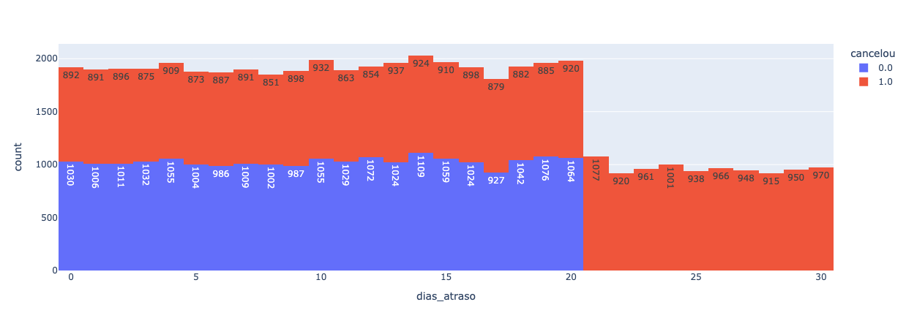

# Customer Churn Analysis with Python

## Sobre o projeto

Este projeto foi desenvolvido para praticar técnicas de Análise de Dados utilizando Python.

A análise foi realizada sobre uma base de clientes com o objetivo de identificar os principais fatores relacionados ao cancelamento de serviços (Customer Churn), gerando insights que possam auxiliar empresas na redução da taxa de cancelamento.

---

## Objetivos

- Importar uma base de dados
- Explorar a estrutura dos dados
- Realizar limpeza e tratamento
- Identificar padrões de cancelamento
- Criar visualizações
- Gerar insights para tomada de decisão

---

## Tecnologias utilizadas

- Python
- Pandas
- Plotly
- Jupyter Notebook

---

## Estrutura do projeto

```text
customer-churn-analysis-python/
│
├── data/
├── images/
├── README.md
├── requirements.txt
└── .gitignore
```

---

## Fluxo da análise

### 1. Importação da base de dados

Leitura do arquivo CSV utilizando Pandas.

### 2. Exploração dos dados

Análise inicial da estrutura da base para identificar possíveis inconsistências.

### 3. Tratamento dos dados

- Remoção de colunas desnecessárias
- Remoção de valores nulos

### 4. Análise exploratória

Análise da quantidade de clientes que cancelaram o serviço.

Resultado:

| Status | Quantidade |
|--------|-----------:|
| Não cancelou | 21.446 |
| Cancelou | 4.821 |

Percentual:

| Status | Percentual |
|--------|-----------:|
| Não cancelou | 81,65% |
| Cancelou | 18,35% |

---

### 5. Visualização dos dados

Foram gerados gráficos para analisar o impacto das variáveis sobre o cancelamento.

#### Contrato


#### Ligações ao Call Center


#### Dias de atraso



---

## Principais Insights

Após a análise foi possível identificar que:

- Clientes com contrato mensal possuem maior taxa de cancelamento.
- Clientes que realizaram mais de quatro ligações ao Call Center apresentam maior probabilidade de cancelar.
- Clientes com mais de vinte dias de atraso também apresentam elevada taxa de cancelamento.

Esses resultados demonstram como a análise de dados pode apoiar decisões estratégicas para aumentar a retenção de clientes.

---

## Autor

**Jhon Santos**

Em transição para a área de Análise de Dados, desenvolvendo projetos práticos com Python, SQL e GitHub.
